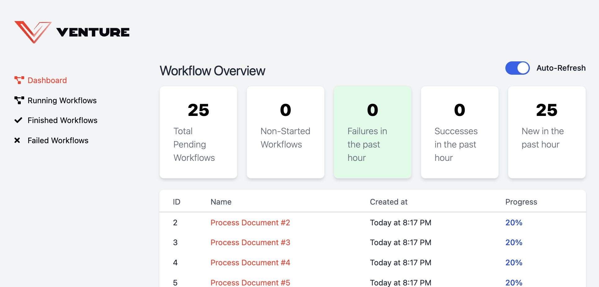
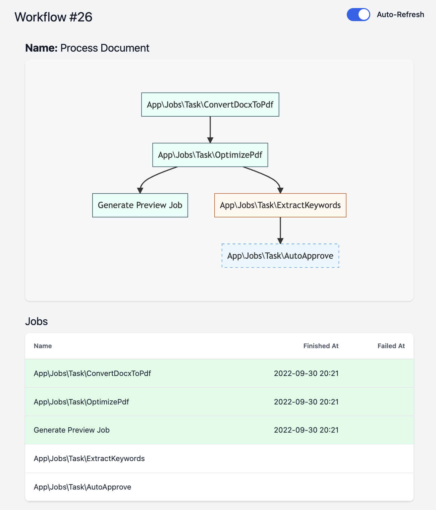

# Venture Dashboard




## Install

```bash
composer require sassnowski/venture-dashboard
```

After install, publish its assets running:

```bash
php artisan venture:dashboard:install
```

## Configuration

You should now have a file in your `Providers` folder called `VentureDashboardServiceProvider`.

You will find some examples like the URL prefix, or how to authenticate users.

```php
Dashboard::auth(function (Request $request): bool {
    return $request->fromVPN();
});
```

## Contribute: To-do

- [ ] Pagination
- [x] Add overview stats
  - [ ] Allow to change between hourly/daily
- [ ] Finish readme
- [ ] Tests (JobNameResolver)

#### Advanced:
- [ ] Publish a migration with db indexes for this dashboard. (or not)
- [ ] Button to Re-try failed workflow.
- [ ] Show elapsed time between started (added to the queue) and finished.
- [ ] Upgrade to Vue 3

- Provide a way to detect the slowest Jobs

## Credits

- [Kai Sassnowski](https://github.com/ksassnowski)
- [All contributors](https://github.com/ksassnowski/venture/contributors)
